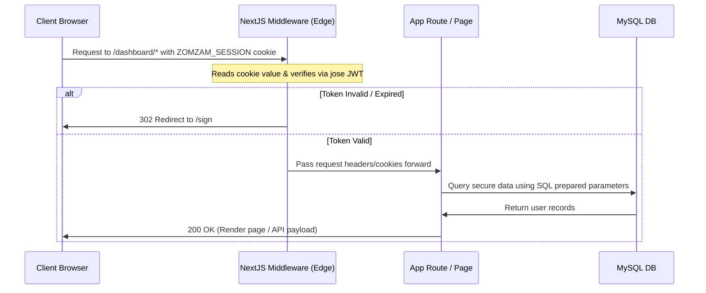
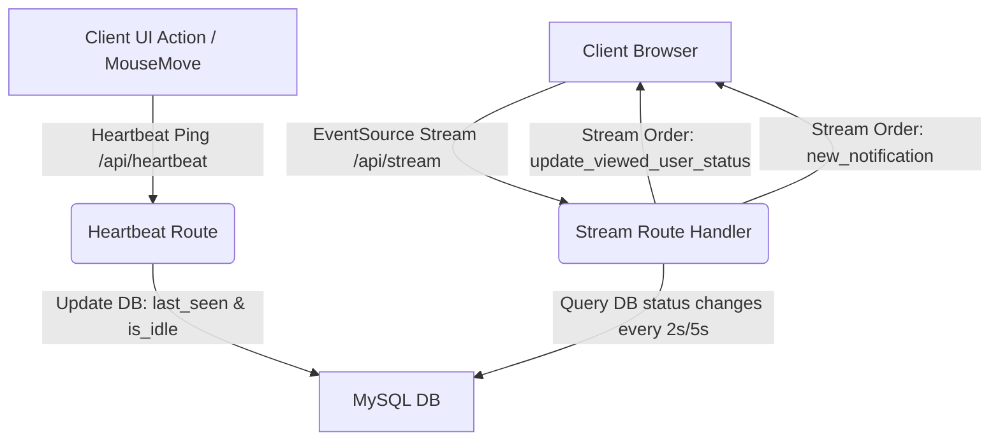

# Zomzam.com 🚀 | Developer Documentation & Architecture Guide

Welcome to the **Zomzam** developer workspace! This document serves as the master guide for engineers and developers working on the Next.js migration of Zomzam. Zomzam is a professional life and money management platform built with a **Zenith-Tier architecture**, cinematic UI/UX details, and real-time synchronization.

---

## 🎯 Platform Overview & Core Tech Stack

Zomzam is designed to bridge the gap between day-to-day productivity (Time Suite) and long-term financial sovereignty (Money Suite). The system is fully reactive, localized, and multi-tenant ready.

| Layer | Technology | Rationale & Trade-offs |
| :--- | :--- | :--- |
| **Framework** | **Next.js 16.2 (App Router)** | SSR & Server Components for SEO and fast loading; Edge Route Handlers for high concurrency. |
| **UI Library** | **React 19** | Leverage Server Components, improved concurrent rendering, and native element hooks. |
| **Styling** | **Tailwind CSS v4 & Vanilla CSS** | Modern CSS variables, Tailwind engine for atomic utility styling, custom HSL palettes. |
| **Database** | **MySQL (via `mysql2/promise`)** | High performance, transaction safety, and sub-millisecond query execution on structured schemas. |
| **Security** | **Jose JWT (Edge) & BcryptJS** | Edge-runtime compatible token signing/validation; high-rounds bcrypt salt for password protection. |
| **Streaming** | **Server-Sent Events (SSE)** | Low-overhead server-push pipe for real-time presence sync without the overhead of WebSockets. |
| **Animation** | **GSAP (GreenSock) & Confetti** | 60FPS UI choreography and rewarding micro-interactions on task completions. |

---

## 📁 Repository Directory Structure

The Next.js codebase is structured to enforce **Atomic Separation of Concerns (SoC)**:

```bash
zomzam.com/
├── scripts/                  # Database schema synchronizers and seeding scripts
│   └── db-sync.ts            # Self-healing database migrator (seeding default accounts/categories)
├── src/
│   ├── app/                  # Next.js App Router root
│   │   ├── (dashboard)/      # Authenticated dashboard route group (shares layout wrapper)
│   │   │   ├── community/    # Developer directory and profile cards (accessible at /community)
│   │   │   ├── dashboard/    # Primary user dashboard (accessible at /dashboard)
│   │   │   ├── layout.tsx    # Central dashboard layout wrapper with navigation sidebar
│   │   │   ├── me/           # Settings page for user profiles (accessible at /me)
│   │   │   ├── money/        # Money account details, transactions, and lend tracking (accessible at /money/*)
│   │   │   ├── settings/     # Security, primary currency, and system preferences (accessible at /settings)
│   │   │   └── time/         # Time execution timers, planning boards, ideas, and tasks (accessible at /time/*)
│   │   ├── api/              # Serverless API routes (Heartbeats, SSE Stream, Auth, Time, Money)
│   │   │   ├── auth/         # Login, Registration, Password reset
│   │   │   ├── heartbeat/    # Out-of-band active state & notifications sync
│   │   │   ├── money/        # Transactions, Accounts, and Lending API
│   │   │   ├── profile/      # User info modifications & password updates
│   │   │   ├── social/       # User connection graphs (Friendships, Follows)
│   │   │   ├── stream/       # SSE (Server-Sent Events) streaming connection
│   │   │   └── time/         # Pomodoro timers, Ideas, Tasks, and Planning horizons API
│   │   ├── sign/             # Unified Sign In / Sign Up split-screen layout
│   │   ├── u/                # Public vanity profiles (e.g., /u/username)
│   │   ├── globals.css       # Core Tailwind configuration and global glassmorphism styles
│   │   ├── layout.tsx        # Base HTML Shell, provider wrappers, and language direction controllers
│   │   ├── page.tsx          # Marketing landing page with multi-language showcases
│   │   └── providers.tsx     # Global context aggregation wrapper
│   │
│   ├── context/              # Client-Side Global State Contexts
│   │   ├── MoneyContext.tsx  # Multi-currency balances, cash flows, and accounts context
│   │   ├── StreamWaiterContext.tsx # Active SSE listener, idle triggers, and toasts
│   │   └── TranslationContext.tsx # Dynamic multi-language dictionary (RTL support for Arabic/Hebrew)
│   │
│   ├── lib/                  # Backend Shared Logic
│   │   ├── auth.ts           # Token cryptography, verification, and hash parameters
│   │   ├── db.ts             # Connection pools and transaction callbacks
│   │   └── models/           # Database operations (user.ts, etc.)
│   │
│   └── middleware.ts         # Global routing guard validating JWT cookies on Edge
└── .env                      # Workspace environment definitions (Git-ignored)
```

---

## ⚙️ Setting Up the Developer Environment

Follow these steps to spin up the local development suite:

### 1. Prerequisites
Ensure you have **Node.js (v18+)** and a running **MySQL (v8.x+)** server.

### 2. Configure the Environment
Create a `.env` file in the root directory:
```env
# Database Credentials
DB_HOST=localhost
DB_PORT=3306
DB_NAME=zomzam_db
DB_USER=root
DB_PASS=your_mysql_password
DB_CHARSET=utf8mb4

# JSON Web Token Secret
JWT_SECRET=super_secret_zomzam_jwt_key_2026_zenith_tier

# Environment Settings
NODE_ENV=development
```

### 3. Initialize & Seed the Database
Execute the self-healing DB script to create the tables, verify column definitions, and seed initial metrics:
```bash
npx tsx scripts/db-sync.ts
```
*Note: This creates the default user profile accounts (cash, banks, cards) and budgets for `user_id = 1`.*

### 4. Install Dependencies & Start Dev Server
```bash
# Install NPM modules
npm install

# Boot local Next.js dev listener
npm run dev
```
Open [http://localhost:3000](http://localhost:3000) in your web browser.

---

## 🔒 Authentication & Session Middleware

Zomzam implements a **Trust-Zero API Architecture** to protect private user workspaces:



### Authentication Core Code:
* **Token Verification**: [auth.ts](file:///c:/www/zomzam.com/src/lib/auth.ts) signs and verifies user credentials.
* **Routing Guard**: [middleware.ts](file:///c:/www/zomzam.com/src/middleware.ts) dynamically matches paths (e.g., `/dashboard`, `/time`, `/money`, `/settings`) and intercepts unauthenticated requests. It uses the edge-optimized library `jose` to verify tokens cleanly without triggering Node-only environment crashes.

---

## 📡 Real-Time Presence & Sync Engine

Zomzam avoids polling overhead by maintaining a continuous data pipeline via **Server-Sent Events (SSE)**.



### Connection Walkthrough:
1. **Heartbeat API** ([route.ts](file:///c:/www/zomzam.com/src/app/api/heartbeat/route.ts)):
   Every 25 seconds (or upon mouse movement), the client sends an out-of-band POST request reporting if the user is `idle` (1) or `active` (0).
2. **EventSource Listener** ([StreamWaiterContext.tsx](file:///c:/www/zomzam.com/src/context/StreamWaiterContext.tsx)):
   Establishes a persistent GET request to `/api/stream`. If the connection drops, it executes a custom exponential backoff reconnection protocol.
3. **SSE Loop** ([route.ts](file:///c:/www/zomzam.com/src/app/api/stream/route.ts)):
   Keeps the connection open with a `ReadableStream`. It monitors the connection's abort signal, executing query lookups:
   * **Active state**: Polls every 2 seconds.
   * **Idle state**: Down-throttles to 5 seconds to conserve server resources.
   * Clears the user's `stream_queue` JSON array from MySQL and pushes notifications or availability changes to the client as structured SSE strings (`event: order`).
4. **Public Profile Syncing** ([PublicUserStatus.tsx](file:///c:/www/zomzam.com/src/app/u/[username]/PublicUserStatus.tsx)):
   When a viewer visits the public profile page `/u/[username]`, the client-side `PublicUserStatus` component mounts and initializes its own `StreamWaiterProvider`. On mount, it sets the `viewingUserId` to the profile owner's ID, initiating a connection to `/api/stream?viewing_user_id=[profileUserId]`. The server's stream loop checks for status updates on that specific user and pushes `update_viewed_user_status` orders to the browser, updating the badge (ONLINE, AWAY, OFFLINE) in real-time.

---

## ⏳ Time Management Architecture

The Time Management ecosystem consists of three main components:

### A. Focus Engine (Pomodoro)
* Code: [page.tsx](file:///c:/www/zomzam.com/src/app/(dashboard)/time/execution/page.tsx)
* Features:
  * Adjusts session timer intervals and break durations.
  * Handles focus durations dynamically using drift-corrected time stamps in `localStorage` so timers remain perfectly synced even across multiple open tabs.
  * Triggers particle confetti explosions upon task completion and focus completions.

### B. Dream Planning Board
* Code: [page.tsx](file:///c:/www/zomzam.com/src/app/(dashboard)/time/planning/page.tsx)
* Columns: `This Week`, `This Month`, `This Year`.
* Drag & Drop: Leverages standard HTML5 draggable elements. Dragging a goal between columns updates the DB record (`time_horizons.type`) via POST request to `/api/time` with action `move_horizon`.

### C. Idea Vault
* Multiline text capture that allows notes to be stored, edited, deleted, and optionally linked back to active focus tasks or planning horizons.

---

## 💰 Money Management Architecture

Financial transactions are governed by the **50/30/20 Budgeting Rule**:
* **Needs (50%)**: Mandatory living costs (Bills, rent, food).
* **Wants (30%)**: Lifestyle expenses (Hobbies, eating out).
* **Savings (20%)**: Financial growth (Investments, debt payoff, emergencies).

### Key Systems:
* **Ledger API**: Records balances, accounts, and lending records.
* **Multi-Currency Converter**: Displays net worth in the user's chosen primary and secondary currencies.
* **Lending System**: Tracks debts owed to the user (`owe_me`) or by the user (`i_owe`) with status parameters (`pending`, `partial`, `settled`).

---

## 🌐 Dynamic Localization & RTL Support

Internationalization (i18n) is managed natively without heavy packages:
* **Translation Store**: Defined within [TranslationContext.tsx](file:///c:/www/zomzam.com/src/context/TranslationContext.tsx).
* **RTL Language Detection**: When the language is set to Arabic (`ar`) or Hebrew (`he`), the context automatically adjusts the `<html>` document tag:
  ```typescript
  document.documentElement.setAttribute('dir', 'rtl');
  document.documentElement.setAttribute('lang', language);
  ```
  All layouts instantly flip direction naturally thanks to Tailwind's logical layout tags (like `start-0`, `end-0`, and `flex-row-reverse`).

---

## 🛠️ Developer Contribution Guidelines

To maintain Zenith-Tier code standards, please follow these guidelines:

1. **Keep Code Structures Flat**:
   Use **Early Return Guard Clauses** to keep nesting to a minimum.
   ```typescript
   // Correct Pattern
   if (!user) return NextResponse.json({ success: false }, { status: 401 });
   if (!title) return NextResponse.json({ success: false, error: 'Empty Title' });
   // Execute logic...
   ```
2. **Maintain Type Safety**:
   Provide TypeScript interfaces for all data rows and API payload types.
3. **Database Security**:
   Always use parameterized prepared statements in DB queries. Never concatenate SQL parameters.
4. **Clean up Resources**:
   When writing React hooks, always return cleanup functions to clear background intervals, SSE listeners, or DOM event listeners.

Let's build something extraordinary! 🚀
