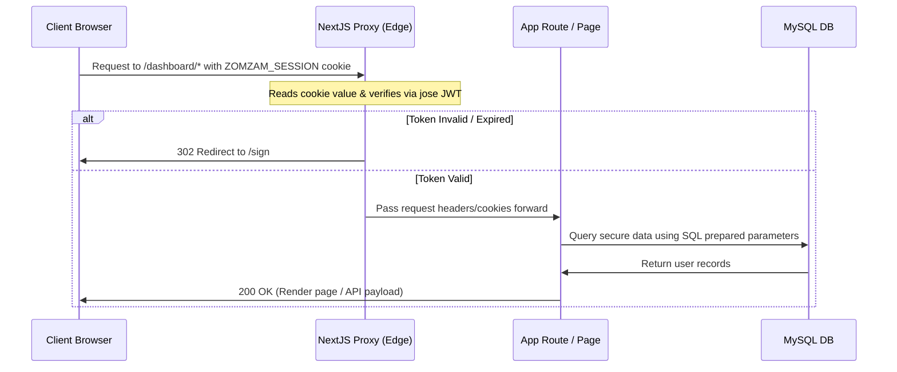
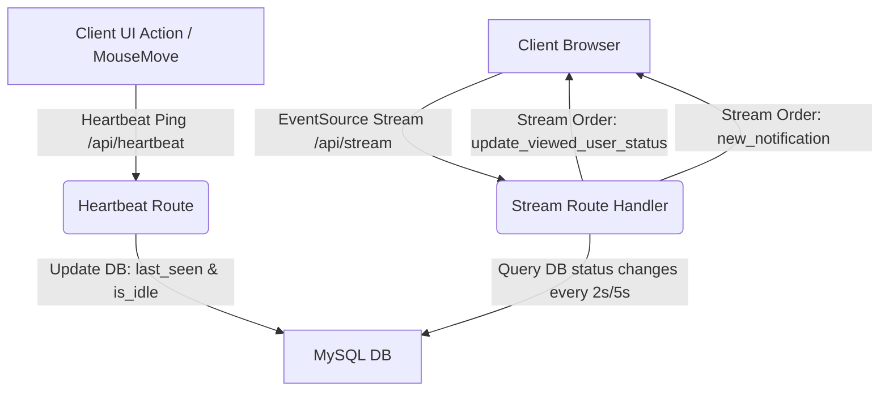

# Zomzam.com 🚀 | Developer Documentation & Architecture Guide

Welcome to the **Zomzam** developer workspace! Zomzam is a custom, high-orbit personal operating system that merges time engineering and wealth management into a single, high-fidelity digital dashboard. Built with a **Zenith-Tier architecture**, cinematic UI/UX details, and real-time synchronization, it is designed to feel premium, bespoke, and state-of-the-art.

---

## 🌟 The Vision: What is Zomzam & Why We Are Building It

### What Zomzam is For
Zomzam is a unified control center for a user's life. Instead of forcing users to scatter their personal data across fragmented platforms—using one app for Pomodoro tracking, another for notes, a third for budgeting, and yet another for tracking debts—Zomzam merges these suites into a single, cohesive interface. It balances daily execution metrics (**Time Suite**) with long-term financial sovereignty (**Money Suite**).

### Why We Are Building It
1. **Technological Sovereignty**: In an era of intrusive tracking and ad-driven subscription bloat, Zomzam provides a privacy-first, fully owned repository for personal time and currency ledgers.
2. **Unified Cognitive Flow**: Transitioning between tasks and tracking financial records should not introduce cognitive load. Zomzam bridges the *Gulfs of Execution and Evaluation* by presenting clear, immediate feedback, and unified visual signifiers.
3. **Cinematic Visual Excellence**: Productivity tools shouldn't feel boring. We believe that tools which inspire interaction are tools that get used. Zomzam features sleek dark modes, fluid micro-animations, glassmorphism aesthetics, and real-time Server-Sent Events (SSE) presence synchronization.

---

## ⚡ Core Platform Functions & Capabilities

The platform is divided into three major suites:

### 1. ⏳ The Time Suite (Time Engineering)
* **Pomodoro Focus Engine** (`/time/execution`): A drift-corrected productivity timer that runs in real-time, allowing users to select tasks, manage custom focus and break durations, and persist timer states across multiple open browser tabs. Includes reward mechanics (particle confetti effects).
* **Task Checklist Manager** (`/time/tasks`): Create, edit, prioritize, and delete tasks. Integrates custom select inputs for priority levels (`Urgent`, `Medium`, `Maybe`, `Free`) and duration blocks, complete with safe undo actions to revert accidental deletions.
* **Dream Planning Board** (`/time/planning`): A drag-and-drop workflow visualizer dividing goals into three planning horizons: *This Week*, *This Month*, and *This Year*.
* **Idea Vault** (`/time/ideas`): A quick-capture scratchpad for writing down raw thoughts, notes, and log details.

### 2. 💰 The Money Suite (Wealth Ledger)
* **Financial Net Worth Dashboard** (`/money/dashboard`): Aggregate balances across all active cards, banks, and cash accounts, display real-time income/expense distribution, and automatically convert figures between custom Primary and Secondary currencies.
* **Bank Ledger & Accounts** (`/money/accounts`): Add, modify, and manage financial entities (Cash, Bank accounts, Credit/Debit cards) with initial balances and multi-currency denominations.
* **Income & Expense logs** (`/money/income` & `/money/expenses`): Categorized transaction ledgers that enforce the **50/30/20 Budgeting Rule** (categorizing transactions as *Needs*, *Wants*, or *Savings*).
* **Lending & Debt tracker** (`/money/lend`): Log outstanding loans and borrowings (`owe_me` or `i_owe`), define payment dates, and track settlement statuses (`pending`, `partial`, `settled`).

### 3. 💼 The CRM Suite (Client Relations & Lead Generation)
* **Map Leads Scraper** (`/crm`): A geographic prospecting interface that pulls active local business data directly from Google Maps (via custom Place Search proxy) and simulates lead acquisition pipelines.
* **Lead Vault Directory** (`/crm/leads`): A structured leads database supporting quick search, niche filtering, status adjustments, and batch deletion controls.
* **Kanban Pipeline Board** (`/crm/pipeline`): Visual deal-tracking columns representing lead lifecycles. Dragging a lead to `Qualified` launches a contract setup modal to select deposit accounts and payment dates, triggering multi-suite data bridges.
* **Client Profiles** (`/crm/contacts`): Standardized client contact directory.
* **Campaign Outreach Hub** (`/crm/outreach`): AI-assisted cold email writing tool using Claude Sonnet APIs (falling back to tailored design-audit templates if keys are missing) with signature customizations.
* **Projects Hub** (`/crm/projects`): Delivery tracking for won client contracts, mapping development milestones (`Planning`, `Design`, `Feedback Review`, `Production Delivered`) to automated task-completion indicators.

### 4. 🌐 Preferences & Social Integration (Platform Core)
* **Home Feed** (`/home`): A post composer (with `@mention` autocomplete popover) and a real-time feed of posts from the user's network, with like/comment/delete actions. Individual posts expand to a permalink view at `/p/[postId]`.
* **System Preferences** (`/settings`): Refactored to use unified UI selects for timezone adjustment (with live clock previews), multi-language configuration, and primary/secondary currency selections.
* **Vanity Public Profiles** (`/u/[username]`): Public profile directories featuring real-time presence indicators (Online, Away, Offline) synchronized dynamically via Server-Sent Events (SSE) based on user mouse movements and idle timers.
* **Social Connections** (`/community`): A member directory showing user availability, network contacts, follows, friend requests, and discovery suggestions.
* **Notifications**: A heartbeat-synced notification stream (likes, comments, friend requests) with read/unread state, surfaced in the dashboard topbar.
* **Account Recovery** (`/forgot-password`): Token-based password reset flow, independent of the authenticated session.
* **Strict Security Guardrails**: Dynamic JWT edge middleware routing checks, cryptographically secure Bcrypt password hashing, and zero leak logs.

---

## 🎯 Platform Overview & Core Tech Stack

Zomzam is designed to bridge the gap between day-to-day productivity (Time Suite) and long-term financial sovereignty (Money Suite). The system is fully reactive, localized, and multi-tenant ready.

| Layer | Technology | Rationale & Trade-offs |
| :--- | :--- | :--- |
| **Framework** | **Next.js 16.2 (App Router)** | SSR & Server Components for SEO and fast loading; Edge Route Handlers for high concurrency. |
| **UI Library** | **React 19** | Leverage Server Components, improved concurrent rendering, and native element hooks. |
| **Component Kit** | **Zomzam Kit** (`src/components/ui`, homegrown — 27 primitives) | A self-owned design system instead of shadcn/ui or Radix UI — zero external UI dependency, full control over every interaction. Browseable live at `/ui-kit`. |
| **Styling** | **Tailwind CSS v4** (`@theme` CSS-first tokens) | Modern CSS variables, Tailwind engine for atomic utility styling, custom HSL/Zomzam-Orange palettes defined directly in `globals.css`. |
| **Database** | **MySQL (via `mysql2/promise`)** | High performance, transaction safety, and sub-millisecond query execution on structured schemas. |
| **Security** | **Jose JWT, BcryptJS & DOMPurify** | A single `jose`-based session module (`src/lib/session.ts`) signs/verifies the `ZOMZAM_SESSION` JWT for both the Edge proxy and Node API routes (`jsonwebtoken` removed). The same `jose` dependency also verifies Google's `id_token` via remote JWKS for "Sign in with Google" (`src/lib/google-oauth.ts`) — no separate OAuth library installed. API routes are gated by a `withAuth()` wrapper (`src/lib/api-auth.ts`), not the proxy; high-rounds bcrypt salt for password protection; post HTML is sanitized server-side with `isomorphic-dompurify` (tag allowlist) before storage; login/register are IP rate-limited (`src/lib/rate-limit.ts`). |
| **Streaming** | **Server-Sent Events (SSE)** | Low-overhead server-push pipe for real-time presence sync without the overhead of WebSockets. |
| **Animation** | **GSAP + `@gsap/react`** (centralized in `src/lib/gsap.ts`) | `ScrollTrigger`, `SplitText`, `Observer`, `Flip`, and `ScrambleTextPlugin` registered once; powers the shared `usePageEntrance` reveal hook. `canvas-confetti` handles reward bursts. No Framer Motion. |
| **3D / Ambient Visuals** | **three.js + React Three Fiber** | Shader background (`Silk.tsx`) on the landing page only, lazy-loaded client-side and gated by `useDesktopWebGL` (`(min-width:1024px) and (pointer:fine)` + idle) so the three.js chunk never downloads on phones/tablets — they get a static CSS-gradient fallback. The dashboard shell uses a zero-cost static CSS gradient (the former `LiquidEther` WebGL fluid sim was removed in the P3 perf pass — its non-stop rAF loop cost ~11s TBT on every authenticated route). |
| **Icons** | **Lucide React** | Consistent, tree-shakeable icon set across the Kit and every feature page. |
| **Maps** | **`@vis.gl/react-google-maps`** | Powers the CRM Map Leads Scraper's Place Search interface. |
| **Image Processing** | **`sharp` + `@vercel/blob`** | `sharp` re-encodes/resizes avatar and post images server-side (strips EXIF); the result is uploaded to Vercel Blob (`src/lib/uploads.ts`) rather than local disk, since Vercel's serverless functions have a read-only filesystem at runtime. |

---

## 📁 Repository Directory Structure

The Next.js codebase is structured to enforce **Atomic Separation of Concerns (SoC)**:

```bash
zomzam.com/
├── BrandGuideLine.md          # Zenith-Tier brand guide: color/type/depth/motion design tokens
├── scripts/
│   └── db-sync.ts             # Self-healing database migrator (creates/validates schema, seeds defaults)
├── src/
│   ├── app/                   # Next.js App Router root
│   │   ├── (dashboard)/       # Authenticated dashboard route group (shares layout.tsx wrapper)
│   │   │   ├── community/     # /community, /community/discover, /following, /friends, /requests
│   │   │   ├── crm/           # /crm, /crm/contacts, /leads, /outreach, /pipeline, /projects
│   │   │   ├── dashboard/     # /dashboard — primary metrics dashboard
│   │   │   ├── home/          # /home — social feed + post composer
│   │   │   ├── me/            # /me — profile settings
│   │   │   ├── money/         # /money/accounts, /dashboard, /expenses, /income, /lend
│   │   │   ├── settings/      # /settings — timezone, language, currency preferences
│   │   │   ├── time/          # /time/execution, /ideas, /planning, /tasks, /tracker
│   │   │   └── layout.tsx     # Sidebar nav, topbar, notifications, presence, ambient WebGL background
│   │   ├── api/                # Serverless API routes
│   │   │   ├── auth/           # Login, registration, logout, session check, settings
│   │   │   │   ├── forgot-password/  # Issue password-reset tokens
│   │   │   │   └── reset-password/   # Consume a reset token, set new password
│   │   │   ├── crm/            # Leads, scrape jobs, pipeline, contacts, projects, AI outreach, Notion sync settings
│   │   │   ├── dashboard/      # Aggregated cross-suite metrics for /dashboard
│   │   │   ├── heartbeat/      # Active/idle presence ping (every 25s or on mouse movement)
│   │   │   ├── money/          # Accounts, transactions, lending ledger
│   │   │   ├── notifications/  # Notification list + mark-as-read
│   │   │   ├── notion/         # Notion integration settings + lead sync
│   │   │   ├── posts/          # Feed, create/like/delete/comment on posts
│   │   │   ├── profile/        # Profile field updates, avatar upload (sharp -> Vercel Blob)
│   │   │   │   └── change-password/  # Authenticated password change
│   │   │   ├── shops/          # Google Places proxy (nearby business search, backs the CRM map scraper)
│   │   │   ├── social/         # Friend requests, follows, blocks, discovery, search
│   │   │   ├── stream/         # SSE streaming connection (presence + notification push)
│   │   │   └── time/           # Pomodoro tasks, planning horizons, ideas
│   │   ├── forgot-password/    # /forgot-password — public password recovery page
│   │   ├── p/[postId]/         # /p/[id] — single post permalink view
│   │   ├── sign/                # /sign — unified Sign In / Sign Up split-screen layout
│   │   ├── u/[username]/       # /u/[username] — public vanity profile + live presence badge
│   │   ├── ui-kit/              # /ui-kit — dev-only showcase of every src/components/ui primitive
│   │   ├── globals.css         # Tailwind v4 @theme tokens, glassmorphism, shadow/motion utilities
│   │   ├── layout.tsx           # Base HTML shell, provider wrappers, language/dir controller
│   │   ├── global-error.tsx     # Root render-crash boundary — reports the crash (email) + recoverable fallback
│   │   ├── page.tsx             # Marketing landing page (multi-language, Silk WebGL hero)
│   │   └── providers.tsx        # Global context aggregation wrapper (mounts ErrorReporter)
│   │
│   ├── components/
│   │   ├── ui/                  # The Zomzam Kit — 27 primitives (Button, Card, Modal, Toast, …) + index.ts barrel
│   │   ├── chat/                # Global realtime UI: ChatDock (docked chat windows), RightSidebar (persistent right nav: Messages + Active Now presence + Suggested), NotificationToaster (live toast)
│   │   ├── crm/                 # CRM-specific: KanbanBoard, LeadCard, LeadDetailsModal, MapAutocomplete, ScraperPanel
│   │   ├── ErrorReporter.tsx    # Global client error listener (uncaught errors + unhandled rejections → /api/report-error)
│   │   └── Silk.tsx              # React Three Fiber shader background (landing page, desktop-gated)
│   │
│   ├── context/                 # Client-side global state
│   │   ├── MoneyContext.tsx           # Multi-currency balances, cash flows, accounts
│   │   ├── MessagesContext.tsx        # Global DM state: contacts model, unread total, docked chat windows, live new_message delivery
│   │   ├── StreamWaiterContext.tsx    # SSE listener, idle triggers, notification toasts
│   │   └── TranslationContext.tsx     # Multi-language dictionary + RTL (Arabic/Hebrew) direction control
│   │
│   ├── hooks/
│   │   └── usePageEntrance.ts   # Shared GSAP page-entrance reveal (title/card/list-item stagger)
│   │
│   ├── lib/
│   │   ├── session.ts           # jose JWT sign/verify (Edge + Node) — single secret, fail-fast on boot
│   │   ├── api-auth.ts          # withAuth/withError route gates + getSessionUser (is_active + token_version revocation)
│   │   ├── http-error.ts        # HttpError — runtime-free status-bearing error (services throw it; api-auth maps it)
│   │   ├── rate-limit.ts        # In-memory sliding-window limiter (login/register throttle, bug-report throttle)
│   │   ├── bug-report.ts        # Email-on-error reporter (Resend HTTP API, throttled, never throws; recipient defaults to 2004.Sanfor@gmail.com)
│   │   ├── auth.ts              # bcrypt password hashing helpers
│   │   ├── google-oauth.ts      # Google Sign-In: auth URL builder, code exchange, id_token verify (jose remote JWKS)
│   │   ├── facebook-oauth.ts    # Facebook Sign-In/Sign-Up (server): verify JS-SDK access token (/debug_token) + Graph API profile fetch
│   │   ├── facebook-sdk.ts      # Facebook Sign-In/Sign-Up (client): browser-only JS SDK loader + FB.login() → access token
│   │   ├── db.ts                # MySQL connection pool + transaction helpers
│   │   ├── gsap.ts               # Single source of truth for GSAP + plugin registration
│   │   ├── notion.ts             # Notion API client for CRM lead sync
│   │   ├── utils.ts              # cn() class merger, currency conversion rates
│   │   ├── services/             # Per-suite business logic extracted from the route megaswitches
│   │   │   ├── crm.ts           # CRM logic + qualify_lead cross-suite bridge (+ crm.test.ts)
│   │   │   ├── posts.ts         # Social feed/comment logic + sanitizer + tag ranking (+ posts.test.ts)
│   │   │   └── dashboard.ts     # Cross-suite rollup + blended hourly-rate math (+ dashboard.test.ts)
│   │   └── models/
│   │       └── user.ts          # User table queries
│   │
│   └── proxy.ts                  # Edge routing guard validating the ZOMZAM_SESSION JWT cookie
└── .env                          # Workspace environment definitions (Git-ignored)
```

---

## 🗺️ Complete Site Map

### Pages

| Route | Access | Purpose |
| :--- | :--- | :--- |
| `/` | Public | Marketing landing page (multi-language, Silk WebGL hero cards). |
| `/sign` | Public (redirects away if logged in) | Unified Sign In / Sign Up split-screen, OrbitRings ambient background. |
| `/forgot-password` | Public | Request a password-reset token. |
| `/pricing` | Public | Plans & pricing — the free social core vs the paid Pro/Agency tiers that unlock the CRM + Leads suite; monthly/annual toggle, subscribe CTAs. |
| `/home` | Protected | Social feed: post composer with `@mention` autocomplete, live feed (live "new posts" pill). The social right sidebar (Messages / Active Now / Suggested) is now global in the shell, not per-page. |
| `/messages` | Protected | Messenger hub: friends ordered by last-chatted (un-chatted last); selecting one opens a docked live chat window. |
| `/p/[postId]` | Protected | Permalink view for a single post (deep-linkable from the feed). |
| `/dashboard` | Protected | Cross-suite metrics: hourly-rate HUD, activity heatmap, welcome banner. |
| `/time/execution` | Protected | Drift-corrected Pomodoro focus timer with confetti rewards. |
| `/time/tasks` | Protected | Task checklist manager (priority, duration blocks, undoable deletes). |
| `/time/planning` | Protected | Drag-and-drop Dream Planning Board (Week / Month / Year horizons). |
| `/time/ideas` | Protected | Idea Vault quick-capture scratchpad. |
| `/time/tracker` | Protected | Historical focus-session analytics (metric cards + activity list). |
| `/money/dashboard` | Protected | Net-worth aggregation, multi-currency conversion, income/expense split. |
| `/money/accounts` | Protected | Manage cash, bank, and card entities. |
| `/money/income` / `/money/expenses` | Protected | Categorized transaction ledgers (50/30/20 rule). |
| `/money/lend` | Protected | Lending & debt tracker (`owe_me` / `i_owe`), confetti on settlement. |
| `/crm` | Protected | CRM dashboard + Map Leads Scraper (Google Places proxy). |
| `/crm/leads` | Protected | Lead Vault directory — search, filter, status, batch delete. |
| `/crm/pipeline` | Protected | Kanban deal pipeline; qualifying a lead bridges to Money + Time suites. |
| `/crm/contacts` | Protected | Standardized client contact directory. |
| `/crm/outreach` | Protected | AI-assisted cold email writer (Claude Sonnet, template fallback). |
| `/crm/projects` | Protected | Delivery tracker mapped to milestone stages. |
| `/community` | Protected | Member directory: `/discover`, `/following`, `/friends`, `/requests`. |
| `/me` | Protected | Profile settings — avatar upload, bio, tags. |
| `/settings` | Protected | Timezone, language, primary/secondary currency preferences. |
| `/u/[username]` | Public | Vanity public profile with real-time presence badge. |
| `/ui-kit` | Dev-only, unlinked | Live showcase of every `src/components/ui` primitive. |

> Route protection is enforced centrally in `src/proxy.ts` — see the **Authentication & Session Proxy** section below.

### API Endpoints (`src/app/api/**/route.ts`)

| Endpoint | Key actions | Purpose |
| :--- | :--- | :--- |
| `/api/auth` | `register`, `login`, `logout`, `check`, `update_settings` | Session lifecycle and account settings. |
| `/api/auth/forgot-password` / `/reset-password` | — | Token-based password recovery, outside the session. |
| `/api/auth/oauth/google` / `/oauth/google/callback` | — | Google Sign-In: redirects to Google's consent screen, then verifies the returned `id_token` (`jose` remote JWKS) and mints a `ZOMZAM_SESSION` cookie. |
| `/api/auth/oauth/facebook` (POST) | — | Facebook Sign-In/Sign-Up: the browser runs the JS SDK's `FB.login()` and POSTs the returned access token here; the server verifies it (`/debug_token`, must be issued for our app), resolves the profile via the Graph API, and mints a `ZOMZAM_SESSION` cookie. |
| `/api/profile` / `/api/profile/change-password` | — | Profile field updates, avatar upload (`sharp` -> Vercel Blob), authenticated password change. |
| `/api/dashboard` | — | Aggregates Time/Money metrics for the primary dashboard. |
| `/api/time` | `load`, `add/update/complete/delete_task`, `add/move/delete_horizon`, `add/update/delete_idea` | Pomodoro tasks, planning horizons, ideas. |
| `/api/money` | `get_initial_data`, `add/delete_transaction`, `add/delete_account`, `add/settle/delete_lend` | Accounts, transactions, lending ledger. |
| `/api/crm` | `get/add/update/delete_lead(s)`, `qualify_lead`, `create_scrape_job`, `generate_outreach`, `get_dashboard_stats`, `get_contacts`, `get_projects` | Full CRM data layer + AI outreach generation. |
| `/api/shops` | — | Google Places nearby-search proxy (lat/lng/radius/type), backs the CRM map scraper. |
| `/api/notion` | `sync`, `update_settings` | Notion integration for CRM lead sync. |
| `/api/posts` | `feed` (tiered `tier=unseen`/`seen` + keyset `cursor` + `filter=help`/`help_matches`), `mark_seen` (batch read receipts), `comments`, `top_comments`, `create` (status/ask/win), `like`, `comment_vote`, `comment_edit`, `comment_delete`, `delete`, `comment`, `accept_answer`, `resolve_ask` | Home feed CRUD + engagement + favor economy (ask/win, accept-answer bridge). Chat-style feed: unseen posts first (tracked in `post_views`), then seen backfill. |
| `/api/social` | `status`, `friends`, `requests_in/out`, `followers/following`, `discover`, `search`, `friend_request/accept/decline/cancel`, `unfriend`, `block/unblock`, `follow/unfollow` | Full social graph. |
| `/api/notifications` | `mark_read` | Notification list + read-state. |
| `/api/messages` | `contacts`, `thread` (`&peek=1` loads without marking read), `send`, `mark_read`, `typing` (transient peer-is-typing ping, no DB write) | 1:1 direct messages between friends, delivered live via `/api/stream`. `contacts` = all friends ⨝ conversations + presence, ordered last-chatted-first (un-chatted last) — the single model behind the topbar messages dropdown, `/messages`, and the presence rail. |
| `/api/report-error` | — | Client error intake: receives uncaught browser errors / unhandled rejections (from `ErrorReporter`) and emails them via the bug reporter. Public, per-IP throttled, size-capped. |
| `/api/heartbeat` | — | Out-of-band active/idle presence ping (~25s interval). |
| `/api/stream` | — | SSE long-lived connection pushing presence + notification orders (incl. `answer_accepted` / `new_help_request` notifications, the transient `win_prompt` nudge, `new_message` chat delivery, the transient `typing` peer-is-typing ping, the `message_read` "Seen" receipt, and the `new_post` feed-pill fan-out). |

---

## ⚙️ Setting Up the Developer Environment

Follow these steps to spin up the local development suite:

### 1. Prerequisites
Ensure you have **Node.js (v18+)** and a running **MySQL (v8.x+)** server.

### 2. Configure the Environment
Create a `.env` file in the root directory:
```env
# Database Credentials
DB_HOST=localhost
DB_PORT=3306
DB_NAME=zomzam_db
DB_USER=root
DB_PASS=your_mysql_password
DB_CHARSET=utf8mb4

# JSON Web Token Secret — generate a strong random value; never reuse a placeholder.
# The app refuses to boot if this is unset (no insecure fallback).
#   node -e "console.log(require('crypto').randomBytes(48).toString('hex'))"
JWT_SECRET=replace_with_a_random_64_byte_hex_string

# Environment Settings
NODE_ENV=development

# Google Sign-In — Web application OAuth client from
# https://console.cloud.google.com/apis/credentials
GOOGLE_CLIENT_ID=
GOOGLE_CLIENT_SECRET=
GOOGLE_OAUTH_REDIRECT_URI=http://localhost:3000/api/auth/oauth/google/callback

# Facebook Sign-In/Sign-Up (JS SDK) — Facebook Login product from
# https://developers.facebook.com/apps/ (add your domain under "Allowed
# Domains for the JavaScript SDK"). NEXT_PUBLIC_* is the public app id loaded
# by the browser; the secret stays server-side for /debug_token verification.
NEXT_PUBLIC_FACEBOOK_APP_ID=
FACEBOOK_CLIENT_ID=
FACEBOOK_CLIENT_SECRET=

# File uploads — Vercel Blob store (Storage -> Create Database -> Blob in the
# Vercel dashboard auto-injects this in production). For local dev, run
# `vercel env pull .env` or copy the token from the dashboard's "env.local" tab.
BLOB_READ_WRITE_TOKEN=

# Bug reporter — emails unexpected server (500) + uncaught client errors via the
# Resend HTTP API (src/lib/bug-report.ts). Sending turns on once RESEND_API_KEY
# is set; until then it silently no-ops (console.error only).
#   RESEND_API_KEY: https://resend.com/api-keys (required to send)
#   BUG_REPORT_TO:  recipient(s), comma-separated. Defaults to 2004.Sanfor@gmail.com
#   BUG_REPORT_FROM: sender; must be a Resend-verified domain. Defaults to
#     onboarding@resend.dev (Resend test mode only delivers to the account owner).
RESEND_API_KEY=
BUG_REPORT_TO=2004.Sanfor@gmail.com
BUG_REPORT_FROM=
```

### 3. Initialize & Seed the Database
Execute the self-healing DB script to create the tables, verify column definitions, and seed initial metrics:
```bash
npx tsx scripts/db-sync.ts
```
*Note: This creates the default user profile accounts (cash, banks, cards) and budgets for `user_id = 1`.*

### 4. Install Dependencies & Start Dev Server
```bash
# Install NPM modules
npm install

# Boot local Next.js dev listener
npm run dev
```
Open [http://localhost:3000](http://localhost:3000) in your web browser.

### 5. Run the Tests
The service layer (`src/lib/services/`) is covered by unit tests on Node's built-in runner (via `tsx`, no extra pinned dependency). Boundaries (`@/lib/db`, uploads, etc.) are mocked; the `qualify_lead` cross-suite bridge and per-suite ownership scoping are the focus.
```bash
npm test
```

---

## 🔒 Authentication & Session Proxy

Zomzam implements a **Trust-Zero API Architecture** to protect private user workspaces:



### Authentication Core Code:
* **Session Tokens**: [session.ts](file:///c:/www/zomzam.com/src/lib/session.ts) is the single place a `jose` JWT is signed/verified (Edge proxy + Node routes). [api-auth.ts](file:///c:/www/zomzam.com/src/lib/api-auth.ts) exposes the `withAuth()`/`withError()` route gates and `getSessionUser()`, which also enforces `is_active` + `token_version` revocation. [auth.ts](file:///c:/www/zomzam.com/src/lib/auth.ts) is now bcrypt-only.
* **Google Sign-In**: [google-oauth.ts](file:///c:/www/zomzam.com/src/lib/google-oauth.ts) builds the consent-screen URL and exchanges the returned code for an `id_token`, verified against Google's live JWKS via `jose`'s `createRemoteJWKSet` — no extra OAuth dependency needed. `/api/auth/oauth/google` sets a short-lived `state` + `redirect` cookie pair (CSRF check) before redirecting to Google; `/api/auth/oauth/google/callback` verifies `state`, then calls `findOrCreateGoogleUser()` ([user.ts](file:///c:/www/zomzam.com/src/lib/models/user.ts)) to link-by-verified-email or create a password-less account before minting the same `ZOMZAM_SESSION` cookie as credential login.
* **Facebook Sign-In/Sign-Up** (JS SDK): [facebook-sdk.ts](file:///c:/www/zomzam.com/src/lib/facebook-sdk.ts) loads Facebook's browser SDK once and runs `FB.login()` to obtain a short-lived user access token client-side; the `/sign` page POSTs that token to `/api/auth/oauth/facebook`. [facebook-oauth.ts](file:///c:/www/zomzam.com/src/lib/facebook-oauth.ts) verifies it server-side via `/debug_token` (must be valid **and** issued for our `app_id` — the token is untrusted browser input) before resolving the profile (`id`, `email`, `name`, `picture`) through the Graph API. The route then calls `findOrCreateFacebookUser()` ([user.ts](file:///c:/www/zomzam.com/src/lib/models/user.ts)) to link-by-email or create a password-less account before minting the `ZOMZAM_SESSION` cookie. Users who decline the `email` permission get a `no_email` guidance message instead of a half-created account; a dismissed login dialog is treated as a silent no-op.
* **Routing Guard**: [proxy.ts](file:///c:/www/zomzam.com/src/proxy.ts) protects every page by **default-deny** — only an explicit public allowlist (`/`, `/sign`, `/forgot-password`, `/u`, `/p`, `/ui-kit`, `/pricing`) is reachable without a session; everything else redirects to `/sign`. So a newly added page can never be accidentally left unguarded. It verifies tokens via the shared edge-safe `verifySession` (`jose`) without triggering Node-only environment crashes; API authorization itself lives in `withAuth()` at the route layer, not the proxy.

---

## 📡 Real-Time Presence & Sync Engine

Zomzam avoids polling overhead by maintaining a continuous data pipeline via **Server-Sent Events (SSE)**.



### Connection Walkthrough:
1. **Heartbeat API** ([route.ts](file:///c:/www/zomzam.com/src/app/api/heartbeat/route.ts)):
   Every 25 seconds (or upon mouse movement), the client sends an out-of-band POST request reporting if the user is `idle` (1) or `active` (0).
2. **EventSource Listener** ([StreamWaiterContext.tsx](file:///c:/www/zomzam.com/src/context/StreamWaiterContext.tsx)):
   Establishes a persistent GET request to `/api/stream`. If the connection drops, it executes a custom exponential backoff reconnection protocol.
3. **SSE Loop** ([route.ts](file:///c:/www/zomzam.com/src/app/api/stream/route.ts)):
   Keeps the connection open with a `ReadableStream`. It monitors the connection's abort signal, executing query lookups:
   * **Active state**: Polls every 2 seconds.
   * **Idle state**: Down-throttles to 5 seconds to conserve server resources.
   * Clears the user's `stream_queue` JSON array from MySQL and pushes notifications or availability changes to the client as structured SSE strings (`event: order`).
4. **Public Profile Syncing** ([PublicUserStatus.tsx](file:///c:/www/zomzam.com/src/app/u/[username]/PublicUserStatus.tsx)):
   When a viewer visits the public profile page `/u/[username]`, the client-side `PublicUserStatus` component mounts and initializes its own `StreamWaiterProvider`. On mount, it sets the `viewingUserId` to the profile owner's ID, initiating a connection to `/api/stream?viewing_user_id=[profileUserId]`. The server's stream loop checks for status updates on that specific user and pushes `update_viewed_user_status` orders to the browser, updating the badge (ONLINE, AWAY, OFFLINE) in real-time.

---

## ⏳ Time Management Architecture

The Time Management ecosystem consists of three main components:

### A. Focus Engine (Pomodoro)
* Code: [page.tsx](file:///c:/www/zomzam.com/src/app/(dashboard)/time/execution/page.tsx)
* Features:
  * Adjusts session timer intervals and break durations.
  * Handles focus durations dynamically using drift-corrected time stamps in `localStorage` so timers remain perfectly synced even across multiple open tabs.
  * Triggers particle confetti explosions upon task completion and focus completions.

### B. Dream Planning Board
* Code: [page.tsx](file:///c:/www/zomzam.com/src/app/(dashboard)/time/planning/page.tsx)
* Columns: `This Week`, `This Month`, `This Year`.
* Drag & Drop: Leverages standard HTML5 draggable elements. Dragging a goal between columns updates the DB record (`time_horizons.type`) via POST request to `/api/time` with action `move_horizon`.

### C. Idea Vault
* Multiline text capture that allows notes to be stored, edited, deleted, and optionally linked back to active focus tasks or planning horizons.

---

## 💰 Money Management Architecture

Financial transactions are governed by the **50/30/20 Budgeting Rule**:
* **Needs (50%)**: Mandatory living costs (Bills, rent, food).
* **Wants (30%)**: Lifestyle expenses (Hobbies, eating out).
* **Savings (20%)**: Financial growth (Investments, debt payoff, emergencies).

### Key Systems:
* **Ledger API**: Records balances, accounts, and lending records.
* **Multi-Currency Converter**: Displays net worth in the user's chosen primary and secondary currencies.
* **Lending System**: Tracks debts owed to the user (`owe_me`) or by the user (`i_owe`) with status parameters (`pending`, `partial`, `settled`).

---

## 🔗 Cross-Suite Data Bridges & Transaction Engine

Zomzam's unique value is its interconnectedness. Instead of siloed databases, events in one module automatically cascade across the entire platform through transactional integrity.

### The Deal Qualification Bridge
When a deal is qualified (moved to **Closed Won** / **Qualified** on the Kanban Board):
1. **CRM State**: Updates lead status to `qualified`.
2. **Projects State**: Spawns a new delivery tracker inside `crm_projects` with milestone stages.
3. **Time Suite Sync**: Seeds 4 task blocks in the task queue (`time_tasks`) representing standard development deliverables:
   * *Client Kickoff Consultation*
   * *Mockup Blueprint Redesign*
   * *Outreach Feedback Review*
   * *Production Delivery & Launch*
4. **Money Suite Sync**:
   * Creates an income entry in `money_transactions` categorized under `Salary/Outreach` for the contract's total amount.
   * Increments the user's chosen deposit bank account balance.
   * If a due date is specified, creates an outstanding debtor ledger entry under `money_lend` (`owe_me`), tracking that the client owes the user that amount.

### The Delivery Completion Bridge
When the final development task (containing the phrase `Production Delivery & Launch`) is completed on the **Task Board**, the database trigger intercepts the mutation:
* Automatically updates the associated project delivery status to `delivered`.

---

## 🧩 The Zomzam Kit (UI Component Library)

Zomzam ships its own component library at `src/components/ui` instead of depending on shadcn/ui, Radix UI, or Framer Motion — every interaction primitive is owned, styled with the project's Tailwind v4 tokens, and free of third-party UI churn.

* **27 primitives**, all importable from `@/components/ui`: Accordion, Alert, AudienceSwitch, Avatar, Badge, Breadcrumb, Button, Calendar, Card, Checkbox, CountUp, Divider, Dropdown, Input, Modal, NumberInput, Pagination, Progress, Radio, Skeleton, Slider, Spinner, Switch, Tabs, Textarea, Toast, Tooltip.
* **Live showcase** at [`/ui-kit`](file:///c:/www/zomzam.com/src/app/ui-kit/page.tsx) — a dev-only route (unlinked from navigation, no auth gate) rendering every primitive with its real variants, sizes, and states. Nothing on that page reads or writes live data.
* **Shared motion**: `src/hooks/usePageEntrance.ts` drives the standard page-load reveal (title mask, staggered card/list entrances) via GSAP, respecting `prefers-reduced-motion` automatically. GSAP itself is centralized in `src/lib/gsap.ts` so plugins register exactly once.
* **Extension rule**: if the Kit doesn't have what a feature needs, build it once inline — then promote it into `src/components/ui` the moment a second page needs the same pattern, following the existing `variant`/`size`/`shape` prop conventions (see `Button.tsx`).

---

## 🌐 Dynamic Localization & RTL Support

Internationalization (i18n) is managed natively without heavy packages:
* **Translation Store**: Defined within [TranslationContext.tsx](file:///c:/www/zomzam.com/src/context/TranslationContext.tsx).
* **RTL Language Detection**: When the language is set to Arabic (`ar`) or Hebrew (`he`), the context automatically adjusts the `<html>` document tag:
  ```typescript
  document.documentElement.setAttribute('dir', 'rtl');
  document.documentElement.setAttribute('lang', language);
  ```
  All layouts instantly flip direction naturally thanks to Tailwind's logical layout tags (like `start-0`, `end-0`, and `flex-row-reverse`).

---

## 🛠️ Developer Contribution Guidelines

To maintain Zenith-Tier code standards, please follow these guidelines:

1. **Keep Code Structures Flat**:
   Use **Early Return Guard Clauses** to keep nesting to a minimum.
   ```typescript
   // Correct Pattern
   if (!user) return NextResponse.json({ success: false }, { status: 401 });
   if (!title) return NextResponse.json({ success: false, error: 'Empty Title' });
   // Execute logic...
   ```
2. **Maintain Type Safety**:
   Provide TypeScript interfaces for all data rows and API payload types.
3. **Database Security**:
   Always use parameterized prepared statements in DB queries. Never concatenate SQL parameters.
4. **Clean up Resources**:
   When writing React hooks, always return cleanup functions to clear background intervals, SSE listeners, or DOM event listeners.
5. **Use the Kit First**:
   Check `src/components/ui` (and the `/ui-kit` showcase) before writing new markup or reaching for an external UI/animation library — see [The Zomzam Kit](#-the-zomzam-kit-ui-component-library) above.

Let's build something extraordinary! 🚀
