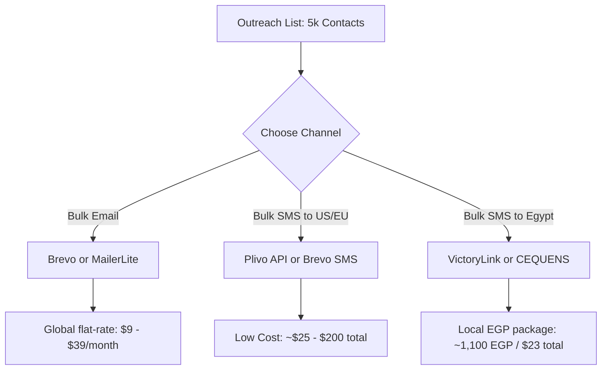

# Deep Search Report: Bulk SMS & Email Services (4,000–5,000 Contacts)
### Target Regions: US, Europe, and Egypt

This document provides a highly detailed, comprehensive analysis of the top industry providers for bulk SMS and email campaigns. It compares delivery models, pricing structures, features, and hidden fees to help select the best fit for your marketing model.

---

## 📋 Comprehensive Provider Comparison Matrix

| Provider | Service Channels | Service Delivery Model | Email Pricing (5,000 sends/mo) | US/EU SMS Pricing (per msg) | Egypt SMS Pricing (per msg) | Key Target / Best For |
| :--- | :--- | :--- | :--- | :--- | :--- | :--- |
| **Brevo** (formerly Sendinblue) | Email & SMS | Web Campaign Builder + REST API. Supports Drag-and-drop design, contact lists, and automation. | **$9.00 / month** (Unlimited contacts, 5k sends) | US: **~$0.009** EU: **~€0.045 - €0.06** | **~$0.18 - $0.35** (extremely high international routing rates) | **Overall Winner for Email:** Non-tech marketers & API-driven hybrid outreach. |
| **VictoryLink** | SMS only | Web portal + REST API. Major local Egyptian aggregator. | *N/A (SMS Only)* | US/EU: *Not recommended (High rates)* | **~22 PT (EGP)** (approx. **$0.0045** / SMS) | **Egypt SMS Winner:** Cheapest and most reliable for sending SMS inside Egypt. |
| **CEQUENS** | SMS (and Voice) | Developer API + Web portal. Regional Middle-East carrier. | *N/A (SMS Only)* | US/EU: *Medium rates* | **Usage-based (EGP)** (highly competitive local direct routes) | Middle-East regional businesses needing NTRA-compliant SMS & WhatsApp APIs. |
| **Plivo** | SMS (and Voice) | Developer API-only. Developer-friendly documentation, number pooling. | *N/A (SMS Only)* | US: **$0.0050** EU: **~€0.015 - €0.065** | **~$0.16 - $0.35** (Vodafone: $0.161, Telecom Egypt: $0.35) | **US/EU SMS Winner:** Developers looking for the lowest cost API. |
| **Twilio & SendGrid** | Email & SMS | Twilio (SMS API) + SendGrid (Email API & Marketing UI). Powerful analytics, developer-first. | **$20.00 / month** (SendGrid Marketing, up to 5k contacts) | US: **$0.0079** EU: **~€0.035 - €0.075** | **~$0.19 - $0.40** (extremely high international gateway rates) | Large scale enterprise requiring complex workflows and custom deliverability. |
| **MailerLite** | Email only | Beautiful, user-friendly drag-and-drop builder, contact forms, newsletters. Web UI focused. | **$39.00 / month** (Unlimited sends up to 5k contacts) | *N/A (Email Only)* | *N/A (Email Only)* | Non-developers wanting high-converting visual emails and newsletters. |
| **Bird** (formerly MessageBird) | Email & SMS | Unified API platform. Minimal marketing UI (mostly API integrations). | **$10.00 / month** (approx. 5k transactional sends) | US: **$0.0074** EU: **~€0.038 - €0.058** | **~$0.18 - $0.35** (international routing) | Multi-channel communication workflows requiring global SMS routing. |
| **Mailjet** | Email & SMS | Drag-and-drop email editor + REST API + transactional SMS gateway. European compliance. | **$9.00 / month** (Starter plan, 8,000 sends) | US: **~$0.011** EU: **~€0.040 - €0.055** | **~$0.18 - $0.35** (international routing) | European teams seeking gdpr-compliant combined email + SMS API. |
| **Amazon SES** | Email only | Infrastructure API-only. Zero user interface for writing campaigns. Requires custom development. | **$0.50 / month** ($0.10 per 1,000 emails) | *N/A (Email Only)* | *N/A (Email Only)* | **Cheapest Email:** Large tech teams who can build their own UI. |

---

## 🔍 Detailed Provider Breakdown

### 1. VictoryLink (The Egypt SMS Champ)
*   **How the Service is Done:**
    *   **Web Portal:** Simple dashboard to upload a CSV sheet of Egyptian phone numbers, write a template in Arabic or English, and schedule the broadcast.
    *   **API Integration:** API endpoints for programmatic SMS dispatch in EGP.
*   **Pricing:**
    *   Prepaid package structure:
        *   **1,000 SMS:** 230 EGP (23 PT/SMS)
        *   **5,000 SMS:** **1,100 EGP** (22 PT/SMS = **approx. $22.90 USD** for 5,000 texts).
        *   **10,000 SMS:** 2,100 EGP (21 PT/SMS)
*   **Pros:** The absolute cheapest rates for Egypt; direct carrier connections to Vodafone, Orange, Etisalat, and WE; local support for NTRA compliance.
*   **Cons:** Not suitable for US/Europe messaging; web UI is simple and lacks advanced email marketing features.

---

### 2. CEQUENS (Middle East Enterprise Leader)
*   **How the Service is Done:**
    *   Web campaign console and REST APIs supporting SMS, WhatsApp Business, and Voice solutions.
*   **Pricing:**
    *   Usage-based pricing in EGP/USD. Highly competitive regional routes for Egypt compared to global CPaaS platforms.
*   **Pros:** Native compliance with Egypt's NTRA regulations; high deliverability and direct regional carrier routing.
*   **Cons:** Requires direct sales contact for onboarding and custom rates.

---

### 3. Brevo (Best for Global Email & US/EU SMS)
*   **How the Service is Done:**
    *   **Web Portal:** Feature-rich campaign console. Drag-and-drop HTML email editor, signup forms, list segmentation, A/B testing, and automation workflows.
    *   **API Integration:** Fully documented REST API (`POST https://api.brevo.com/v3/smtp/email` and `/v3/transactionalSMS/send`).
*   **Pricing:**
    *   **Email:** Starter plan at **$9/mo** includes 5,000 emails with unlimited contact storage.
    *   **SMS (US/EU):** Outbound rates range from €0.009 (US) to €0.045–€0.06 (Europe) per message.
    *   **SMS (Egypt):** Extremely expensive international rates (approx. **$0.18 – $0.30+ per message**). 4,500 messages to Egypt would cost **over $800 USD**.
*   **Pros:** Single API key handles both channels; unlimited free contact storage; very easy setup.
*   **Cons:** Daily cap of 300 emails on the free tier; international SMS routing to Egypt is prohibitively expensive.

---

### 4. Plivo (Lowest Cost US/EU SMS API)
*   **How the Service is Done:**
    *   **API-First:** Specifically designed to be integrated into applications (like Zomzam.com). No campaign builder interface.
*   **Pricing:**
    *   **US SMS:** **$0.0050 per message** (4,500 SMS = **$22.50** + carrier surcharges).
    *   **Europe SMS:** Varies by carrier (approx. **€0.015 - €0.06** per text).
    *   **Egypt SMS:** Extremely expensive international rates (Vodafone: **$0.1615/SMS**, Telecom Egypt: **$0.35/SMS**). 4,500 texts to Egypt would run **$720 to $1,575 USD**.
*   **Pros:** The absolute cheapest rates for bulk US/EU texts; highly reliable developer API.
*   **Cons:** Prohibitive pricing for Egypt; requires coding to use; no email.

---

## ⚠️ The Egypt SMS Warning: Avoid the International CPaaS Trap

If your marketing database contains Egyptian contacts, you must pay attention to this critical factor:

> [!CAUTION]
> **International Routing Markup:**
> Global providers (Twilio, Plivo, Brevo, Bird) route SMS to Egypt using international transit gateways. Egyptian carriers charge extreme premium rates for these routes.
> *   Sending 5,000 SMS to Egypt via **Plivo/Twilio** costs: **$720.00 – $1,500.00 USD**
> *   Sending 5,000 SMS to Egypt via **VictoryLink (Local)** costs: **1,100 EGP (approx. $22.90 USD)**
> *   **That is a 30x to 60x markup!** 

### **Sender ID Registration in Egypt**
Egypt's National Telecommunications Regulatory Authority (NTRA) strictly regulates bulk messaging:
1.  **Alphanumeric Sender ID:** Your messages must show your brand name (up to 11 characters) rather than a phone number.
2.  **Registration:** Local carriers require pre-registration of this Sender ID. Sending SMS with an unregistered sender name will result in messages being blocked. VictoryLink can activate your Sender ID in under 2 hours, whereas international CPaaS providers can take weeks or reject it entirely without high-volume commitments.

---

## 🎯 Revised Strategic Recommendation

For your marketing plan involving the US, Europe, and Egypt, we recommend a **hybrid regional approach** to keep costs low and deliverability high:

1.  **For Email:** Use **Brevo ($9/mo)** or **MailerLite ($39/mo)**. It handles subscribers from the US, Europe, and Egypt equally under a single fee.
2.  **For US/Europe SMS:** Use **Plivo** (if integrated via API) or **Brevo SMS** (if using a web UI).
3.  **For Egypt SMS:** Do **NOT** use Brevo, Twilio, or Plivo. Set up a local account with **VictoryLink** or **CEQUENS**. Upload your Egyptian contacts there to send SMS campaigns in EGP. This single decision will save you hundreds of dollars per campaign.

---

## 📊 Final Decision Table

> **How to read this table:** Each row is one provider. "Verdict" tells you whether to use it, skip it, or consider it as a future upgrade. Costs are based on a single campaign of ~5,000 contacts.

| Provider | Channel | Best For | Cost (5k sends) | Verdict |
| :--- | :---: | :--- | :--- | :---: |
| **VictoryLink** | SMS | Egypt contacts only | ~1,100 EGP ($23) | ✅ Use it |
| **Brevo** | Email | All regions — easiest API + UI | $9/mo (300/day cap — takes 17 days for 5k) | ✅ Use it |
| **Plivo** | SMS | US & Europe contacts | ~$22–25 (requires A2P 10DLC registration before first US send) | ✅ Use it |
| **Amazon SES** | Email | All regions — cheapest possible | ~$0.50 total | ⏫ Upgrade path |
| **Resend** | Email | All regions — best developer experience | Free up to 3k/mo, then $20/mo for 50k | ⏫ Consider it |
| **CEQUENS** | SMS | Egypt & Middle East | Custom EGP pricing (contact sales) | 🔄 Backup for Egypt |
| **Mailjet** | Email + SMS | EU teams needing GDPR compliance | $9/mo (8k sends) | 🔄 EU alternative |
| **Twilio + SendGrid** | Email + SMS | Enterprise-scale workflows | $20/mo email + $0.008/SMS | ❌ Skip for now |
| **Bird (MessageBird)** | Email + SMS | Multi-channel API workflows | $10/mo + high SMS rates | ❌ Skip for now |
| **MailerLite** | Email | Non-developers only | $39/mo | ❌ Overpriced for devs |

### Legend
| Icon | Meaning |
| :---: | :--- |
| ✅ | **Use this now** — best cost-to-value for your current stage |
| ⏫ | **Upgrade path** — better long-term but needs more setup time |
| 🔄 | **Situational** — only relevant under specific conditions |
| ❌ | **Skip** — overpriced or wrong fit for a 2-person dev startup |
